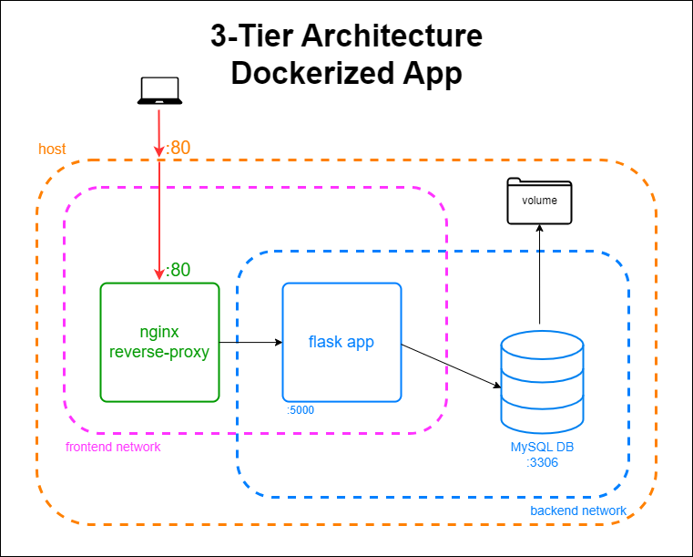
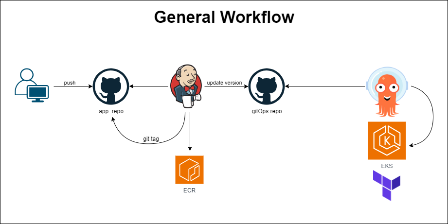

# Hurdle Archive

Are you familiar with Wordle? Of course you are. Hurdle is its nerdier sibling. [Try it out!](https://hurdlegame.io/)

I'll admit I was hooked. One game a day was not enough, and so I created Hurdle Archive. This app allows you to play thousands of Hurdle games! Register as a user and the app will save your played games, your guesses, and your statistics.

## Tech Talk

It's a simple Flask app that uses a MySQL database and hides behind an Nginx reverse-proxy.

## Architecture

Here's an overall look at the architecture:

## Context

This app is a part of my DevOps portfolio. This portfolio is a culmination of my DevOps training and my aim is to improve it over time. You can find the other parts here:

- [Infrastructure repo](https://github.com/nlemberg/hurdle-archive-infra)
- [GitOps repo](https://github.com/nlemberg/hurdle-archive-gitops)

Here's the general workflow, an overview of the entire project's components:

